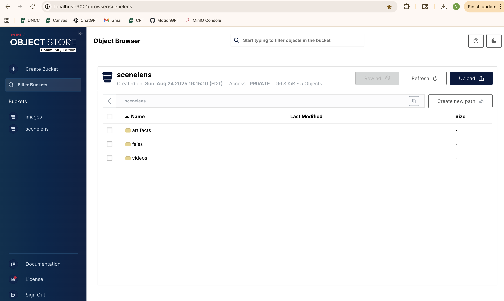
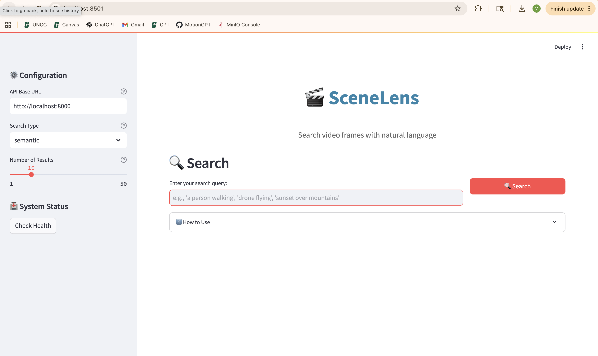

# What we Installed (versions)

- **Python 3.11**: The latest version of Python, providing new features and optimizations.

- **FastAPI**: A modern, fast (high-performance), web framework for building APIs with Python 3.6+ based on standard Python type hints.
- **Uvicorn**: A lightning-fast ASGI server implementation, using `uvloop` and `httptools`.
- **SQLAlchemy**: The Python SQL toolkit and Object Relational Mapper that gives application developers the full power and flexibility of SQL.
- **psycopg2**: The most popular PostgreSQL database adapter for the Python programming language.

- **PyTorch**: An open source machine learning library based on the Torch library, used for applications such as computer vision and natural language processing.
- **Transformers**: State-of-the-art Natural Language Processing for Pytorch and TensorFlow 2.0.
- **Sentence-Transformers**: A Python framework for state-of-the-art sentence, text, and image embeddings.

- **OpenCV**: Open Source Computer Vision Library, an open-source computer vision and machine learning software library.
- **FAISS**: A library for efficient similarity search and clustering of dense vectors.
- **Pillow**: Used for image processing tasks.
- **Pandas**: A fast, powerful, flexible and easy to use open source data analysis and data manipulation library built on top of the Python programming language.

- **Streamlit**: An open-source app framework for Machine Learning and Data Science projects.
- **Requests**: A simple, yet elegant, HTTP library for Python.
- **Tqdm**: A fast, extensible progress bar for Python and CLI.

- **System tools**:
  - **ffmpeg**: A complete, cross-platform solution to record, convert and stream audio and video.
  - **Docker Desktop (PostgreSQL + MinIO)**: Used for containerization, including PostgreSQL and MinIO.

# What Worked

- **MinIO console opened at** [http://localhost:9001](http://localhost:9001): Successfully accessed the MinIO console, which allows for easy management of object storage with a user-friendly interface.

- **FastAPI backend running at** [http://localhost:8000/docs](http://localhost:8000/docs): The FastAPI backend is operational, providing a comprehensive interactive API documentation interface, which facilitates testing and development.

- **Search working (e.g., ?q=colorful)**: The search functionality is fully operational, allowing users to query the database with parameters like '?q=colorful' to retrieve relevant results efficiently.

- **Streamlit UI running at** [http://localhost:8501](http://localhost:8501) **and showing results**: The Streamlit UI is up and running, effectively displaying the results of queries and providing an intuitive interface for user interaction.

 